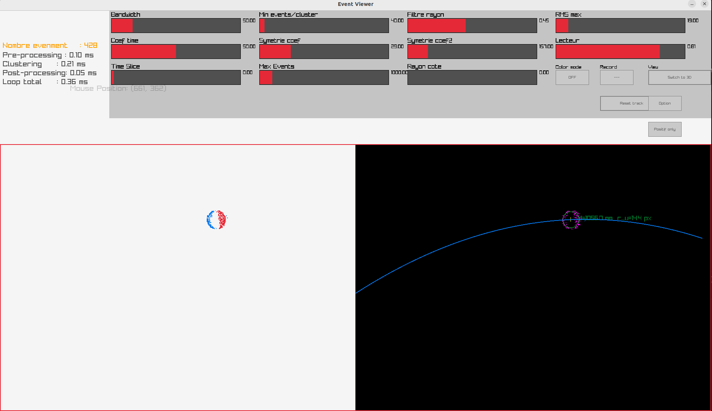
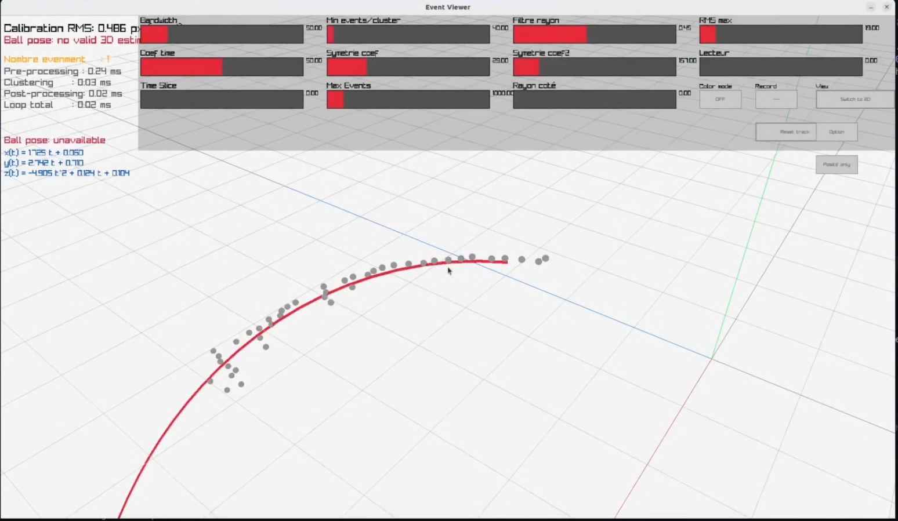

# Event-Based 3D Ball Tracking with DVXplorer and ROS 2

This project is a ROS 2 C++ application for detecting and tracking a moving ball using an event-based camera.  
It uses a DVXplorer event camera, OpenCV calibration, DBSCAN clustering, circle fitting, 3D pose estimation, and a Raylib-based visualization interface.

The long-term objective is to estimate the 3D trajectory of a ball in real time and provide this information to a robotic system capable of catching the ball.

---

## Project Overview

The system processes asynchronous events from a DVXplorer camera and estimates the position of a ball in 3D space.

Main processing pipeline:

1. Acquire event batches from the DVXplorer camera.
2. Apply background activity filtering.
3. Undistort event coordinates using OpenCV camera calibration.
4. Downsample events for real-time processing.
5. Cluster events using DBSCAN.
6. Fit a circle on the detected ball cluster.
7. Estimate the 3D ball position from the apparent circle radius.
8. Fit and display the 3D trajectory.
9. Publish the estimated pose through ROS 2.

---

## Features

- DVXplorer event camera support.
- ROS 2 node for real-time processing.
- Event filtering using `dv-processing`.
- OpenCV camera calibration support.
- DBSCAN-based event clustering.
- Circle fitting for ball detection.
- 3D pose estimation from apparent ball radius.
- 3D trajectory visualization.
- Raylib and Raygui graphical interface.
- Event recording and playback system.
- ROS 2 topic publishing for external robotic control.

---

## Current Status

The project is currently functional as a real-time prototype.

Implemented:

- event acquisition;
- camera calibration loading;
- event undistortion;
- event clustering;
- circle fitting;
- 3D position estimation;
- trajectory fitting;
- 2D and 3D visualization;
- ROS 2 publishing.

Known limitation:

The depth estimation is very sensitive to the detected circle radius.  
At high ball speed, the event trail can artificially increase the apparent radius, which may cause the estimated ball depth to be inaccurate.

---

## Screenshots

### 2D event view and circle fitting



### 3D trajectory view



---

## Repository Structure

```text
.
├── build.sh
├── calibration_camera_DVXplorer_DXA00265-2026_04_23_13_33_50.xml
├── README.md
├── src
│   └── Ball_Tracking_Cpp
│       ├── CMakeLists.txt
│       ├── package.xml
│       ├── include
│       │   └── Ball_Tracking_Cpp
│       │       ├── BallTracker.hpp
│       │       ├── Camera.hpp
│       │       ├── EventWriter.h
│       │       ├── Gui.h
│       │       ├── RegressionAccumulator.hpp
│       │       └── util.hpp
│       └── src
│           ├── BallTracker.cpp
│           ├── Camera.cpp
│           ├── EventWriter.cpp
│           ├── Gui.cpp
│           ├── publisher_member_function.cpp
│           └── DBSCAN
└── .gitignore


Dependencies

This project was developed for ROS 2 on Linux.

Required dependencies:

ROS 2 Humble
CMake
GCC / G++
OpenCV
Eigen3
fmt
TBB
Raylib
Raygui
libusb
dv-processing
DVXplorer camera support