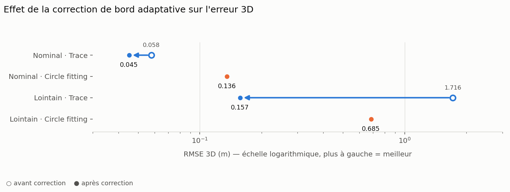
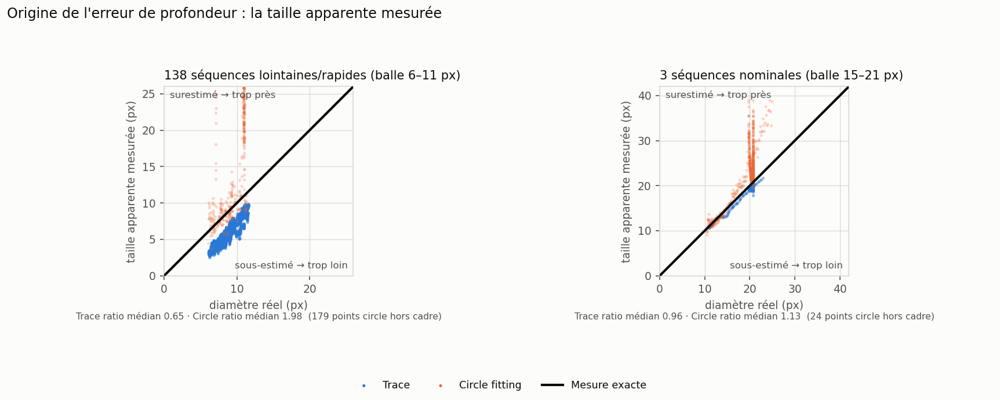
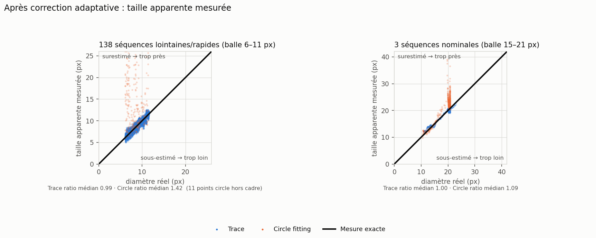
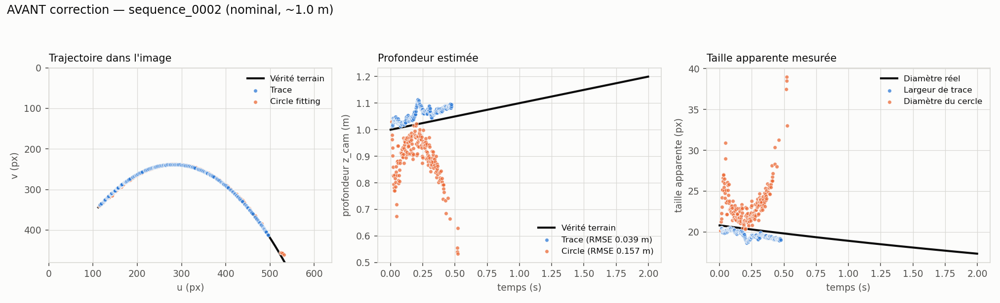
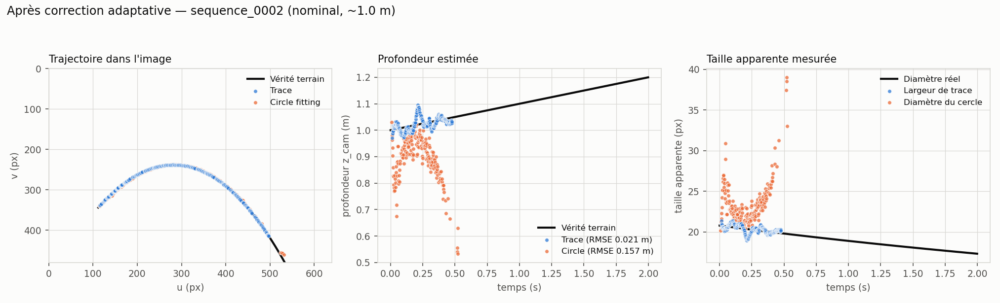
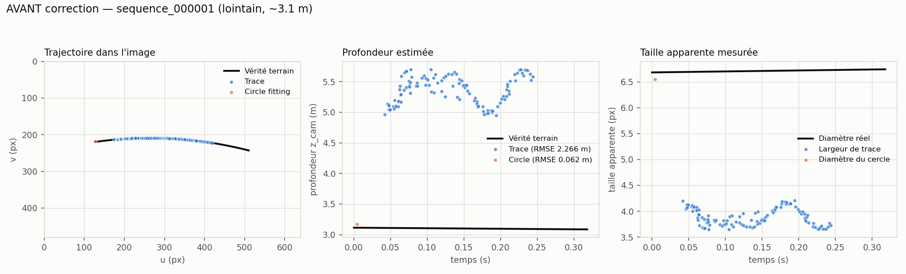
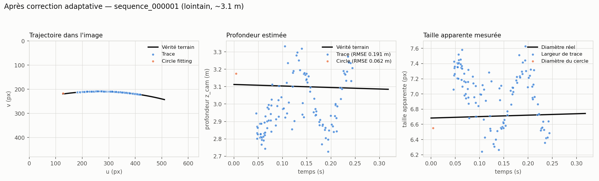

# Trace vs Circle fitting — comparaison quantitative et corrections

Ce document rassemble la comparaison chiffrée des deux méthodes de perception du
projet, le diagnostic des défauts trouvés en la construisant, et les corrections
apportées.

Toutes les mesures viennent de séquences synthétiques Isaac Sim converties en
événements par `v2e`, qui fournissent une vérité terrain exacte. **Aucune
validation sur caméra réelle n'a encore été faite.**

---

## 1. Résumé



| Régime | Méthode | RMSE 3D | RMSE profondeur | RMSE 2D | Taux de détection |
|---|---|---|---|---|---|
| **Nominal** (~1.0–1.4 m, balle 15–21 px) | **Trace** | **0.045 m** | **0.043 m** | **5.4 px** | **0.73** |
| | Circle fitting | 0.136 m | 0.128 m | 9.2 px | 0.47 |
| **Lointain** (1.8–3.4 m, balle 6–11 px) | **Trace** | **0.157 m** | **0.153 m** | **2.16 px** | **0.737** |
| | Circle fitting | 0.685 m | 0.643 m | 7.26 px | 0.013 |

Trace gagne toutes les métriques d'exactitude dans les deux régimes. Le circle
fitting ne conserve qu'un avantage : environ **210× moins de temps de calcul par
échantillon** (0.008 ms contre 1.67 ms).

Ces chiffres sont ceux obtenus **après** les corrections décrites en section 4.
Avant, Trace mesurait 0.058 m en nominal et 1.716 m en lointain.

### Bases de mesure

| Jeu | Séquences | Profondeur | Vitesse | Diamètre apparent |
|---|---|---|---|---|
| Nominal | 3 (`sequence_0001..0003`) | 1.0–1.4 m | — | 15–21 px |
| Lointain | 138 (`benchmark_fast_throw_0500`) | 1.8–3.4 m | 4.4–9.6 m/s | 6–11 px |

Le régime nominal ne compte que 3 séquences : ses chiffres sont indicatifs, pas
statistiques. Le régime lointain correspond aux 138 séquences du benchmark qui
disposent d'un `events_filtered.h5` (sur 500 vidéos générées).

---

## 2. Comment la mesure est faite

L'exécutable `ball_tracker_h5_benchmark` rejoue une séquence `.h5` à travers
**les deux pipelines de production**, sans rien réimplémenter :

- **Trace** : `BuildTracePointsFromFloatSource` → `FitTraceRibbon` → `AnalyzeTrace3D`
- **Circle** : `DvCamera::Echantillon`/`Cluster` → `BallTracker::Update`

Trois conventions décident si les chiffres ont un sens.

**Paramètres intrinsèques.** Chaque séquence porte son propre
`camera/intrinsics.json` (`fx = fy = 520`, `cx = 320`, `cy = 240`, sans
distorsion). Le benchmark **échoue** si ce fichier manque, au lieu de retomber
sur la calibration DVXplorer réelle — ce repli aurait corrompu toutes les
profondeurs sans le signaler. Les valeurs retenues sont réécrites dans
`tracker_output/runtime.json` pour pouvoir auditer un run après coup.

**Repères.** Les deux pipelines sortent la convention monde raylib
`(x_cam, z_cam, −y_cam)` en mètres ; le CSV repasse en repère caméra OpenCV pour
coller aux colonnes de la vérité terrain.

**Horodatage.** Chaque méthode estampille son estimation avec **son propre temps
événementiel** — échantillon milieu de ruban pour Trace, événement le plus récent
de la tranche pour le cercle — et non avec le temps de la grille
d'échantillonnage. La vérité terrain est interpolée à cet instant précis. C'est
ce qui rend la comparaison équitable entre deux méthodes qui n'ont pas la même
latence interne.

### Point de fonctionnement de chaque méthode

Chaque méthode est évaluée à son meilleur réglage, pour qu'aucune ne soit
handicapée.

- **Trace** : les défauts de production (`Ui()` dans `Gui.h`), plus la correction
  de bord de la section 4. Un balayage de `trace_memory_ms` de 30 à 400 ms reste
  entre 0.050 et 0.059 m, donc la valeur de 150 ms est représentative et non
  choisie après coup.
- **Circle fitting** : *pas* ses défauts d'interface. La fenêtre de 484 ms est un
  réglage d'inspection manuelle ; sur cette durée la traînée dépasse largement la
  balle, le rayon ajusté explose et la profondeur s'effondre (0.74 m). Un
  balayage de fenêtre atteint son minimum entre 10 et 20 ms. `min_nb` a aussi dû
  passer de 40 à 5 : sur les lancers épars (~70 événements par fenêtre de 15 ms)
  DBSCAN ne formait aucun point cœur et la méthode marquait **zéro** détection.

---

## 3. Ce qui existait avant est caduc

Un premier harnais (`TraceBenchmark.cpp`) a existé jusqu'au commit `889a684` qui
l'a supprimé. **Il n'appelait jamais l'algorithme Trace** : il ajustait une seule
ACP globale sur toute la fenêtre mémoire de 530 ms puis prenait des quantiles,
donc il renvoyait le centre de l'arc de trajectoire entier au lieu d'une position
instantanée.

Tout ce qu'il a produit — dont le rapport `benchmark_fast_throw_0500` annonçant
**RMSE 2D 118 px et RMSE 3D 1.30 m** — est un artefact de ce bouchon et **ne doit
pas être cité**. Sa suppression avait au passage désactivé silencieusement la
cible CMake, protégée par un `if(EXISTS ...)`.

---

## 4. Correction du biais de largeur de Trace

### Le symptôme

En comparant la taille apparente mesurée au diamètre réel, échantillon par
échantillon :

| Régime | Diamètre balle | Trace mesuré/réel | Circle mesuré/réel |
|---|---|---|---|
| Nominal | 15–21 px | 0.96 | 1.13 |
| Lointain | 6–11 px | **0.65** | 1.98 |



La largeur du ruban était quasi non biaisée sur une grosse balle mais perdait
35 % sur une petite, **alors que la trajectoire dans l'image restait excellente**
(2.2 px). Le défaut était donc localisé dans le seul estimateur de largeur, et il
dépendait de l'échelle.

Conséquence directe : la profondeur vaut `Z = f · D / w`, donc une largeur `w`
sous-estimée de 35 % place la balle 1.5× trop loin.

### Les deux mécanismes

`EstimateSupportedEdges` corrige chaque bord vers l'extérieur, parce que les
événements sont rapportés au centre de pixels entiers alors que le bord réel de
la balle se trouve au-delà du centre le plus extérieur. Cette correction était
écrite comme **une fraction de la largeur mesurée** (`rawWidth * borderRatio`,
3.5 %). Deux choses clochent :

1. **La quantification pixel est une constante** (~0.5 px par côté), pas une
   fraction. Une balle de 20 px reçoit 0.70 px par côté — correct par
   coïncidence ; une balle de 6.7 px reçoit 0.23 px, très insuffisant.
2. **L'érosion par le rayon de support.** `supportedLow`/`supportedHigh` exigent
   `localSupport` événements dans un rayon de `supportRadiusPx` autour d'un bord
   candidat. Sur une traînée éparse, les événements les plus extérieurs sont
   écartés et le bord recule d'une quantité fixée par la **densité
   d'événements**, pas par la taille de la balle. C'est ce terme qui empêchait
   une constante unique de servir les deux régimes.

### La correction

`TraceSupportEdgeSettings` reçoit deux champs. **Tous deux valent 0 par défaut :
le comportement du stack live est inchangé tant qu'ils ne sont pas activés.**

| Champ | Rôle |
|---|---|
| `borderPixels` | Constante, couvre la quantification centre-pixel → bord |
| `borderSpacingFactor` | Multiplie l'espacement **mesuré** des échantillons au bord (`EdgeSampleSpacing`) |

Le second terme s'auto-calibre : pour des échantillons d'espacement moyen `s`, le
bord réel se situe environ à `s` au-delà du plus extérieur. Il est donc grand sur
une traînée éparse et négligeable sur une traînée dense — exactement la
dépendance observée.

À `borderPixels = 0.75` et `borderSpacingFactor = 1.75`, **un seul réglage sert
les deux régimes** :

| Régime | RMSE 3D avant | après | ratio largeur | taux de détection |
|---|---|---|---|---|
| Nominal | 0.058 m | **0.045 m** | 0.96 → **1.00** | inchangé |
| Lointain | 1.716 m | **0.157 m** | 0.65 → **0.99** | inchangé (0.737) |



La mesure de taille apparente est maintenant non biaisée dans les deux régimes :
les points Trace sont sur la diagonale.

### Illustration par séquence

**Régime nominal** (`sequence_0002`, ~1.0 m) — avant puis après :





**Régime lointain** (`sequence_000001`, ~3.1 m) — avant puis après :





Sur la séquence lointaine, en valeurs médianes :

| | largeur mesurée | profondeur estimée |
|---|---|---|
| Avant | 3.85 px (3.65–4.21) | 5.41 m (4.95–5.70) |
| Après | 7.06 px (6.24–7.63) | 2.94 m (2.73–3.33) |
| **Réel** | **6.7 px** | **3.11 m** |

La sous-estimation systématique de la largeur disparaît ; il subsiste une légère
surestimation (7.06 contre 6.7) qui se traduit par une balle placée un peu trop
près. La trajectoire dans l'image, elle, était déjà correcte avant la correction.

---

## 5. Ce que la recherche de paramètres a apporté : rien

`scripts/tune_trace_params.py` a été lancé sur 30 séquences d'entraînement du
régime lointain, avec validation sur 10 séquences jamais vues. Il a déplacé 13
des 15 paramètres et annonçait **−93 % de RMSE**. L'ablation sur les séquences
held-out donne :

| Configuration | RMSE 3D | Taux de détection |
|---|---|---|
| Baseline production | 1.175 m | 0.87 |
| Baseline + correction de bord **seule** | **0.107 m** | **0.87** |
| Tuning complet **sans** la correction de bord | 1.562 m | 0.71 |
| Tuning complet | 0.082 m | 0.71 |

**91 % du gain vient de la seule correction de bord**, et sans elle le profil
entièrement optimisé est *pire* que la baseline. Les 14 autres paramètres se
contorsionnaient pour compenser partiellement un biais que seule la correction de
bord supprime réellement — au prix de 16 points de taux de détection pour les
0.025 m restants.

Sur le régime nominal, la même recherche a rendu **−12 % sur données non vues** et
a déclenché l'avertissement de surapprentissage du script : avec 2 séquences
d'entraînement, elle ajuste du bruit.

Deux conclusions pratiques : **corriger l'estimateur plutôt que régler autour**,
et ne pas livrer de profil de paramètres par distance.

---

## 6. Pourquoi le circle fitting décroche à distance

À 3 m, le circle fitting ne produit une estimation que sur **1.3 %** des
échantillons — un seul point sur `sequence_000001`. DBSCAN n'est pas en cause :
des clusters sont formés pour 2766 échantillons sur 2795, avec une médiane de 26
événements. **92 % des échantillons arrivent avec un cluster et repartent sans
pose.**

Trois mécanismes, par ordre d'impact :

1. **La validation de symétrie des polarités.** `PolarFilter` exige les deux
   polarités présentes et un déséquilibre `|countN − countP| / (countN + countP)`
   sous `symCoef` (0.29). La sortie `v2e` sur ces séquences est déséquilibrée à
   85 % / 15 %, donc un cluster de 26 événements en contient typiquement 22 / 4 et
   se fait rejeter. Le critère encode un a priori physique réel — une balle bien
   résolue montre un bord avant et un bord arrière opposés — mais cet a priori
   cesse d'être valide sous ~11 px.
2. **La garde de saut de profondeur, à état.** Une pose dont la profondeur
   s'écarte de plus de 250 mm de la précédente est rejetée **sans mettre à jour la
   référence**. Dès que le bruit de profondeur dépasse ce seuil, le tracker se
   verrouille et n'émet plus rien pour le reste du lancer — c'est exactement la
   signature « un seul point ». L'ouvrir à 3000 mm fait passer de 36 à 127
   détections sur 20 séquences : réel, mais insuffisant. Le seuil est maintenant
   exposé (`BallTrackerSettings::depthJumpGateMm`, défaut 250 mm inchangé).
3. **Un bug de fidélité du benchmark, corrigé.** Le runner passait les valeurs
   brutes des curseurs `sym_coef`/`sym_coef2`, alors que `Ui::Sym_coef()` les
   divise par 100 avant que le tracker ne les voie (une fraction et un angle en
   radians). Les deux portes de symétrie étaient donc inertes lors de la première
   campagne. Avec elles actives, le circle fitting en régime nominal passe à
   0.136 m pour un taux de 0.47, contre 0.215 m pour 0.74 : la porte fait son
   travail, elle échange du rappel contre de la précision.

---

## 7. Limite physique restante

À 2.5 m la balle fait 8.2 px de diamètre, donc **une erreur de 1 px sur le
diamètre déplace la profondeur d'environ 0.31 m**. Atteindre 0.157 m signifie que
la largeur est désormais estimée à bien moins d'un pixel près.

Il reste donc peu de marge par cette voie : améliorer encore la profondeur à
longue distance demanderait un autre indice que la taille apparente — contrainte
balistique sur la trajectoire, ou seconde vue.

À titre de comparaison, le projet
[`uzh-rpg/event-based_object_catching_anymal`](https://github.com/uzh-rpg/event-based_object_catching_anymal)
(Forrai et al., ICRA'23) rattrape des objets à 15 m/s depuis 4 m avec 83 % de
réussite, à partir d'une caméra événementielle VGA à 100 Hz. Ses paquets sont
`rpg_dynamic_obstacle_detection` et `rpg_ransac_parabola` : clustering, puis une
**parabole ajustée par RANSAC** comme modèle de trajectoire. Le mécanisme
d'estimation de profondeur n'est pas documenté publiquement, donc aucune
affirmation n'est faite ici à son sujet ; on note seulement qu'à 4 m en VGA leur
balle fait environ 5 px, ce qui rend la profondeur par taille apparente encore
plus mal conditionnée que tout ce qui est mesuré ci-dessus.

Une remarque utile pour la suite : une parabole RANSAC régularise le **bruit**,
pas le **biais**. Un a priori balistique appliqué aux estimations biaisées aurait
ajusté une parabole biaisée. Ce dépôt dispose déjà d'une régression balistique
dans `ur3e_live_catch` ; elle est complémentaire de la correction décrite ici, pas
un substitut.

---

## 8. Reproduire

Compiler (la cible CMake se réactive dès que les sources existent) :

```bash
source env.sh
build
```

Une séquence, les deux méthodes :

```bash
./build/ball_tracker_h5_benchmark \
  --events-h5 sequences/sequence_0001/events_v2e/events_filtered.h5 \
  --ground-truth sequences/sequence_0001/labels/ground_truth.csv \
  --camera sequences/sequence_0001/camera/intrinsics.json \
  --metadata sequences/sequence_0001/metadata.json \
  --output-trace /tmp/det_trace.csv \
  --output-circle /tmp/det_circle.csv \
  --runtime-output /tmp/runtime.json \
  --mode both
```

Campagne complète, depuis le dépôt EventGen :

```bash
python3 benchmark/scripts/run_tracker_batch.py --benchmark benchmark/datasets/benchmark_fast_throw_0500 --resume --jobs 8
python3 benchmark/scripts/evaluate_sequence.py --benchmark benchmark/datasets/benchmark_fast_throw_0500 --all --jobs 8
python3 benchmark/scripts/aggregate_results.py --benchmark benchmark/datasets/benchmark_fast_throw_0500
python3 benchmark/scripts/make_report.py --benchmark benchmark/datasets/benchmark_fast_throw_0500
```

Rechercher des paramètres (split train/test, bornes calées sur les clamps de
l'interface, plancher de taux de détection) :

```bash
python3 scripts/tune_trace_params.py \
  --benchmark /home/rigon/Documents/EventGen/ball_event_dataset_v0/benchmark/datasets/benchmark_fast_throw_0500 \
  --limit 40 --trials 100 --rounds 2 --jobs 8 --out /tmp/tune.json
```

---

## 9. Ce qui reste ouvert

- **Aucune validation sur caméra réelle.** Tout est mesuré sur du synthétique
  Isaac/v2e. Le gain nominal devrait se transférer puisqu'il corrige un biais
  géométrique, mais cela demande confirmation sur une séquence DVXplorer réelle.
- La correction de bord reste **désactivée par défaut** dans le code. L'activer
  en live suppose la validation ci-dessus.
- L'érosion de bord n'est que **compensée**, pas supprimée : `borderSpacingFactor`
  modélise son effet moyen. Un estimateur de bord réellement sensible à la
  densité éliminerait le paramètre.
- Seules 138 des 500 séquences du benchmark disposent d'un `events_filtered.h5` ;
  les autres s'arrêtent au stade vidéo ou événements bruts et demanderaient de
  relancer `v2e`.
- Le régime nominal ne repose que sur 3 séquences.

---

## Voir aussi

- `wiki/perception/trace-vs-circle-benchmark.md` — note compilée équivalente
- `wiki/perception/trace-ball-tracking.md` — description de l'algorithme Trace
- `scripts/tune_trace_params.py` — recherche de paramètres
- `src/Ball_Tracking_Cpp/src/OfflineBenchmark.cpp` — implémentation du benchmark
